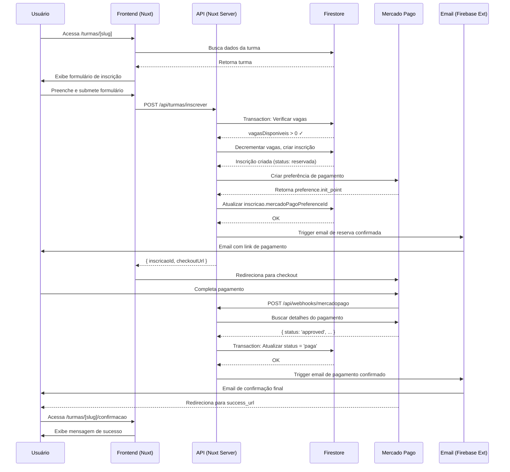
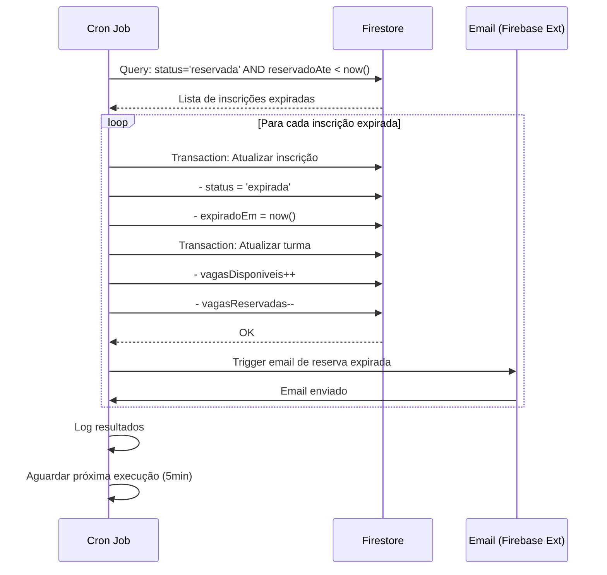
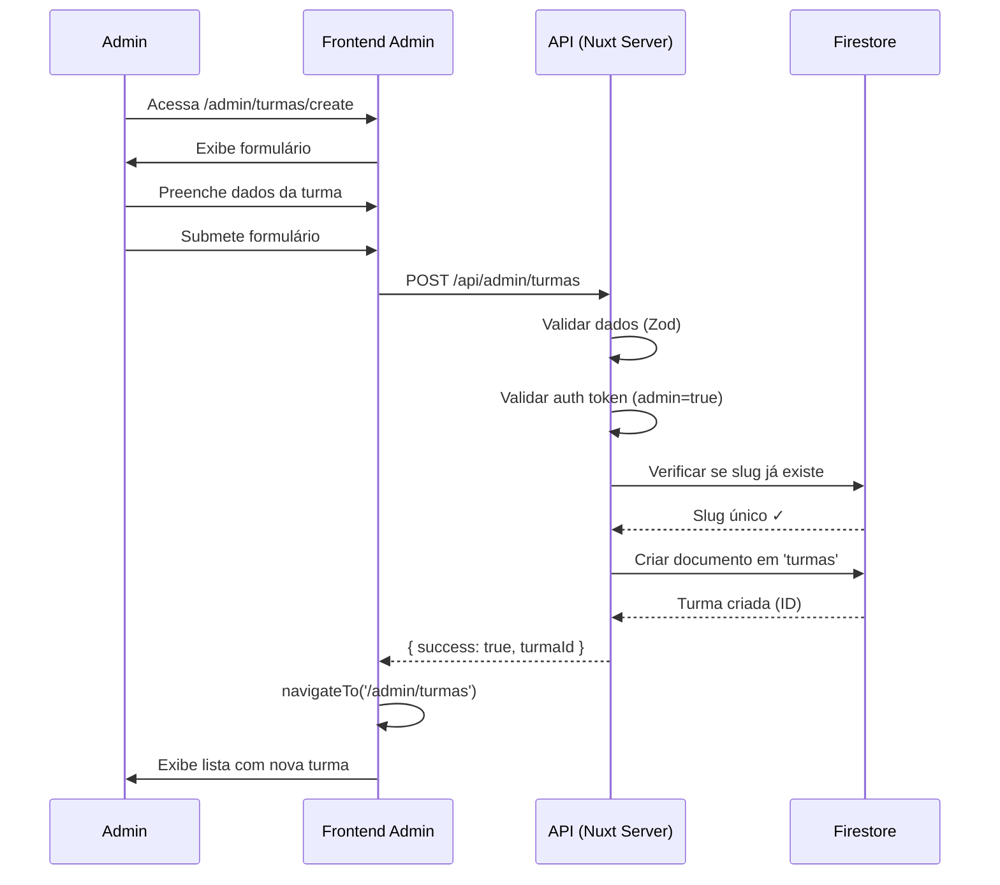

# Arquitetura: IAD-2 - Sistema de Gestão de Turmas e Inscrições

## 1. Visão Geral da Arquitetura

### 1.1 Stack Tecnológica

```
Frontend (Nuxt 3)
├── Vue 3 + TypeScript (Composition API)
├── Tailwind CSS 3 (utility-first)
├── Atomic Design Pattern
└── SSG/ISR rendering

Backend (Firebase + Nuxt API)
├── Firestore (NoSQL database)
├── Firebase Security Rules
├── Nuxt Server Routes (API endpoints)
├── Firebase Extensions (Email triggers)
└── Mercado Pago SDK v2.0

External Services
├── Mercado Pago (payment gateway)
├── Zoho Mail SMTP (email delivery)
└── Firebase Hosting (deployment)
```

### 1.2 Princípios Arquiteturais

1. **Atomic Design**: Componentes organizados hierarquicamente (Atoms → Molecules → Organisms → Templates → Pages)
2. **Server-Side Security**: Todas as operações críticas (pagamento, atualização de vagas) no servidor
3. **Idempotência**: Webhooks e transações devem ser idempotentes (processamento único por `payment_id`)
4. **Transações Atômicas**: Uso de Firestore Transactions para prevenir race conditions
5. **Progressive Enhancement**: Funcionalidade básica sem JavaScript, enhanced com JS
6. **Accessibility First**: WCAG 2.1 AA compliance em todos os componentes

---

## 2. Arquitetura de Dados

### 2.1 Firestore Collections

#### Collection: `turmas`

```typescript
interface Turma {
  // Identificação
  id: string                    // Auto-gerado pelo Firestore
  slug: string                   // URL-friendly (ex: "workshop-junho-2025")

  // Informações Básicas
  nome: string                   // Ex: "Workshop IA do Jeito Certo - Junho 2025"
  descricao: string              // Markdown com descrição completa
  conteudoProgramatico: string   // Markdown com programa detalhado
  imagemCapa?: string            // URL da imagem (Firebase Storage ou CDN)

  // Datas
  dataInicio: Timestamp          // Data/hora de início do workshop
  dataFim: Timestamp             // Data/hora de término

  // Controle de Vagas
  vagasTotal: number             // Ex: 15 (capacidade máxima)
  vagasDisponiveis: number       // Atualizado atomicamente via Transaction
  vagasReservadas: number        // Reservas temporárias (15min)

  // Precificação DINÂMICA
  preco: number                  // Valor em centavos (ex: 4700000 = R$ 47.000,00)
  moeda: string                  // "BRL" (para futuro multi-moeda)

  // Status
  status: 'aberta' | 'em_andamento' | 'finalizada' | 'cancelada'

  // Metadados
  criadoEm: Timestamp
  atualizadoEm: Timestamp
  criadoPor?: string             // UID do admin que criou
}
```

**Índices Necessários**:
```
- status (ascending) + dataInicio (ascending)
- slug (ascending)
- dataInicio (descending)
```

**Security Rules**:
```javascript
rules_version = '2';
service cloud.firestore {
  match /databases/{database}/documents {
    match /turmas/{turmaId} {
      // READ: Público pode ler turmas abertas
      allow read: if resource.data.status == 'aberta';

      // WRITE: Apenas admins autenticados
      allow create, update, delete: if request.auth != null
        && request.auth.token.admin == true;

      // Validação de campos
      allow update: if request.resource.data.keys().hasAll([
        'nome', 'descricao', 'dataInicio', 'dataFim',
        'vagasTotal', 'vagasDisponiveis', 'preco', 'status'
      ]);
    }
  }
}
```

#### Collection: `inscricoes`

```typescript
interface Inscricao {
  // Identificação
  id: string                     // Auto-gerado pelo Firestore
  turmaId: string                // FK para turmas collection

  // Dados do Participante
  nome: string
  email: string
  telefone: string               // Formato: +55 (11) 98765-4321
  empresa: string
  cargo: string

  // Status da Inscrição
  status: 'reservada' | 'aguardando_pagamento' | 'paga' | 'cancelada' | 'expirada'

  // Sistema de Reserva (15 minutos)
  reservadoEm?: Timestamp        // Quando a reserva foi criada
  reservadoAte?: Timestamp       // reservadoEm + 15min
  expiradoEm?: Timestamp         // Quando a reserva expirou

  // Integração Mercado Pago
  mercadoPagoPreferenceId?: string   // ID da preferência de pagamento
  pagamentoId?: string                // ID único do pagamento (idempotency key)
  metodoPagamento?: 'credit_card' | 'debit_card' | 'pix' | 'boleto'
  valorPago?: number                  // Valor em centavos

  // Timestamps
  dataCriacao: Timestamp
  dataConfirmacao?: Timestamp    // Quando pagamento foi confirmado
  dataCancelamento?: Timestamp
  motivoCancelamento?: string

  // Metadados
  origemLead?: string            // UTM ou referral
  notificacoesEnviadas: {
    confirmacaoReserva: boolean
    linkPagamento: boolean
    confirmacaoPagamento: boolean
    lembrete24h: boolean
  }
}
```

**Índices Necessários**:
```
- turmaId (ascending) + status (ascending)
- email (ascending) + turmaId (ascending)
- status (ascending) + reservadoAte (ascending)  // Para cleanup job
- pagamentoId (ascending)  // Para lookup rápido no webhook
```

**Security Rules**:
```javascript
match /inscricoes/{inscricaoId} {
  // READ: Usuário pode ler apenas sua própria inscrição
  allow read: if request.auth != null
    && request.auth.token.email == resource.data.email;

  // READ: Admins podem ler todas
  allow read: if request.auth != null
    && request.auth.token.admin == true;

  // CREATE: Apenas via server-side API (não permite create direto)
  allow create: if false;

  // UPDATE/DELETE: Apenas admins
  allow update, delete: if request.auth != null
    && request.auth.token.admin == true;
}
```

#### Collection: `leads` (existente)

```typescript
interface Lead {
  id: string
  nome: string
  email: string
  telefone: string
  empresa?: string
  cargo?: string
  mensagem?: string
  origem: 'landing_page' | 'inscricao_workshop' | 'contato'
  status: 'novo' | 'qualificado' | 'convertido' | 'perdido'
  criadoEm: Timestamp
  atualizadoEm: Timestamp
}
```

**Integração**: Ao criar uma inscrição, também criar/atualizar lead correspondente.

---

## 3. Arquitetura de Componentes (Atomic Design)

### 3.1 Hierarquia de Componentes

```
components/
├── atoms/
│   ├── TButton.vue                 // Botão base
│   ├── TInput.vue                  // Input text base
│   ├── TTextarea.vue               // Textarea base
│   ├── TLabel.vue                  // Label de formulário
│   ├── TBadge.vue                  // Badge de status
│   ├── TSpinner.vue                // Loading spinner
│   └── TIcon.vue                   // Ícone SVG
│
├── molecules/
│   ├── FormField.vue               // Label + Input + Error
│   ├── StatusBadge.vue             // Badge com cores por status
│   ├── PriceDisplay.vue            // Formatação de preço (R$ 47.000,00)
│   ├── DateDisplay.vue             // Formatação de data
│   └── VagasCounter.vue            // "15 vagas disponíveis"
│
├── organisms/
│   ├── TurmaCard.vue               // Card de turma (lista)
│   ├── TurmaDetails.vue            // Detalhes completos da turma
│   ├── InscricaoForm.vue           // Formulário de inscrição
│   ├── PaymentMethods.vue          // Seleção de método de pagamento
│   ├── AdminTurmaForm.vue          // Formulário admin (criar/editar turma)
│   ├── AdminInscricoesList.vue     // Lista de inscrições (admin)
│   └── AdminTurmasList.vue         // Lista de turmas (admin)
│
├── templates/
│   ├── TurmasListTemplate.vue      // Template da página /turmas
│   ├── TurmaDetailTemplate.vue     // Template da página /turmas/[slug]
│   └── AdminDashboardTemplate.vue  // Template do admin
│
└── pages/
    ├── turmas/
    │   ├── index.vue               // Lista pública de turmas
    │   └── [slug].vue              // Detalhes + formulário de inscrição
    │
    └── admin/
        ├── turmas/
        │   ├── index.vue           // Lista de turmas (admin)
        │   ├── create.vue          // Criar nova turma
        │   ├── [id]/
        │   │   ├── edit.vue        // Editar turma
        │   │   └── inscricoes.vue  // Inscrições da turma
        │   └── components/
        │       └── TurmaFormFields.vue  // Campos compartilhados (create/edit)
        │
        └── middleware/
            └── admin-auth.ts       // Middleware de autenticação admin
```

### 3.2 Componentes Detalhados

#### Atom: `TButton.vue`

```vue
<template>
  <button
    :type="type"
    :disabled="disabled || loading"
    :class="buttonClasses"
    @click="handleClick"
  >
    <TSpinner v-if="loading" class="mr-2" />
    <slot />
  </button>
</template>

<script setup lang="ts">
import { computed } from 'vue'

interface Props {
  variant?: 'primary' | 'secondary' | 'danger' | 'ghost'
  size?: 'sm' | 'md' | 'lg'
  type?: 'button' | 'submit' | 'reset'
  disabled?: boolean
  loading?: boolean
}

const props = withDefaults(defineProps<Props>(), {
  variant: 'primary',
  size: 'md',
  type: 'button',
  disabled: false,
  loading: false,
})

const emit = defineEmits<{
  click: [event: MouseEvent]
}>()

const buttonClasses = computed(() => {
  const base = 'inline-flex items-center justify-center font-semibold transition-colors focus:outline-none focus:ring-2 focus:ring-offset-2'

  const variants = {
    primary: 'bg-blue-600 text-white hover:bg-blue-700 focus:ring-blue-500',
    secondary: 'bg-gray-200 text-gray-900 hover:bg-gray-300 focus:ring-gray-500',
    danger: 'bg-red-600 text-white hover:bg-red-700 focus:ring-red-500',
    ghost: 'text-blue-600 hover:bg-blue-50 focus:ring-blue-500',
  }

  const sizes = {
    sm: 'px-3 py-1.5 text-sm rounded',
    md: 'px-4 py-2 text-base rounded-md',
    lg: 'px-6 py-3 text-lg rounded-lg',
  }

  const disabledClass = props.disabled || props.loading ? 'opacity-50 cursor-not-allowed' : ''

  return `${base} ${variants[props.variant]} ${sizes[props.size]} ${disabledClass}`
})

const handleClick = (event: MouseEvent) => {
  if (!props.disabled && !props.loading) {
    emit('click', event)
  }
}
</script>
```

#### Organism: `InscricaoForm.vue`

```vue
<template>
  <form @submit.prevent="handleSubmit" class="space-y-6">
    <FormField
      v-model="formData.nome"
      label="Nome completo"
      name="nome"
      type="text"
      required
      autocomplete="name"
      :error="errors.nome"
    />

    <FormField
      v-model="formData.email"
      label="E-mail corporativo"
      name="email"
      type="email"
      required
      autocomplete="email"
      :error="errors.email"
    />

    <FormField
      v-model="formData.telefone"
      label="Telefone"
      name="telefone"
      type="tel"
      required
      autocomplete="tel"
      mask="+55 (##) #####-####"
      :error="errors.telefone"
    />

    <FormField
      v-model="formData.empresa"
      label="Empresa"
      name="empresa"
      type="text"
      required
      autocomplete="organization"
      :error="errors.empresa"
    />

    <FormField
      v-model="formData.cargo"
      label="Cargo"
      name="cargo"
      type="text"
      required
      autocomplete="organization-title"
      :error="errors.cargo"
    />

    <div class="bg-blue-50 border border-blue-200 rounded-lg p-4">
      <p class="text-sm text-blue-800">
        Ao clicar em "Reservar vaga", você terá <strong>15 minutos</strong> para completar o pagamento.
        Sua vaga será reservada durante este período.
      </p>
    </div>

    <TButton
      type="submit"
      variant="primary"
      size="lg"
      :loading="isSubmitting"
      :disabled="!isFormValid"
      class="w-full"
    >
      {{ isSubmitting ? 'Reservando...' : 'Reservar vaga e prosseguir para pagamento' }}
    </TButton>

    <p class="text-xs text-gray-600 text-center">
      Ao prosseguir, você concorda com nossos
      <NuxtLink to="/termos" class="underline">Termos de Serviço</NuxtLink> e
      <NuxtLink to="/privacidade" class="underline">Política de Privacidade</NuxtLink>.
    </p>
  </form>
</template>

<script setup lang="ts">
import { ref, computed } from 'vue'
import { z } from 'zod'

interface Props {
  turmaId: string
  vagasDisponiveis: number
}

const props = defineProps<Props>()

const emit = defineEmits<{
  success: [inscricaoId: string, checkoutUrl: string]
  error: [error: Error]
}>()

const formData = ref({
  nome: '',
  email: '',
  telefone: '',
  empresa: '',
  cargo: '',
})

const errors = ref<Record<string, string>>({})
const isSubmitting = ref(false)

// Zod schema para validação
const inscricaoSchema = z.object({
  nome: z.string().min(3, 'Nome deve ter pelo menos 3 caracteres'),
  email: z.string().email('E-mail inválido'),
  telefone: z.string().regex(/^\+55 \(\d{2}\) \d{5}-\d{4}$/, 'Telefone inválido'),
  empresa: z.string().min(2, 'Nome da empresa é obrigatório'),
  cargo: z.string().min(2, 'Cargo é obrigatório'),
})

const isFormValid = computed(() => {
  try {
    inscricaoSchema.parse(formData.value)
    return true
  } catch {
    return false
  }
})

const handleSubmit = async () => {
  errors.value = {}

  // Validação client-side
  try {
    inscricaoSchema.parse(formData.value)
  } catch (err) {
    if (err instanceof z.ZodError) {
      err.errors.forEach((error) => {
        errors.value[error.path[0] as string] = error.message
      })
    }
    return
  }

  isSubmitting.value = true

  try {
    // Chamar API server-side
    const response = await $fetch('/api/turmas/inscrever', {
      method: 'POST',
      body: {
        turmaId: props.turmaId,
        ...formData.value,
      },
    })

    if (response.success) {
      emit('success', response.inscricaoId, response.checkoutUrl)

      // Redirecionar para checkout do Mercado Pago
      window.location.href = response.checkoutUrl
    } else {
      throw new Error(response.error || 'Erro ao processar inscrição')
    }
  } catch (error) {
    console.error('Erro ao criar inscrição:', error)
    emit('error', error as Error)

    // Exibir erro genérico
    errors.value.submit = 'Erro ao processar sua inscrição. Por favor, tente novamente.'
  } finally {
    isSubmitting.value = false
  }
}
</script>
```

#### Organism: `AdminTurmaForm.vue`

```vue
<template>
  <form @submit.prevent="handleSubmit" class="space-y-8">
    <div class="bg-white shadow rounded-lg p-6">
      <h3 class="text-lg font-semibold mb-4">Informações Básicas</h3>

      <div class="space-y-4">
        <FormField
          v-model="formData.nome"
          label="Nome da turma"
          name="nome"
          required
          placeholder="Ex: Workshop IA do Jeito Certo - Junho 2025"
          :error="errors.nome"
        />

        <FormField
          v-model="formData.slug"
          label="Slug (URL)"
          name="slug"
          required
          placeholder="workshop-junho-2025"
          :error="errors.slug"
          help-text="URL-friendly, apenas letras minúsculas, números e hífens"
        />

        <FormField
          v-model="formData.imagemCapa"
          label="Imagem de capa (URL)"
          name="imagemCapa"
          type="url"
          placeholder="https://..."
          :error="errors.imagemCapa"
        />
      </div>
    </div>

    <div class="bg-white shadow rounded-lg p-6">
      <h3 class="text-lg font-semibold mb-4">Descrição e Conteúdo</h3>

      <div class="space-y-4">
        <FormField
          v-model="formData.descricao"
          label="Descrição"
          name="descricao"
          type="textarea"
          required
          :rows="6"
          placeholder="Descrição completa do workshop (suporta Markdown)"
          :error="errors.descricao"
        />

        <FormField
          v-model="formData.conteudoProgramatico"
          label="Conteúdo Programático"
          name="conteudoProgramatico"
          type="textarea"
          required
          :rows="10"
          placeholder="Programa detalhado (suporta Markdown)"
          :error="errors.conteudoProgramatico"
        />
      </div>
    </div>

    <div class="bg-white shadow rounded-lg p-6">
      <h3 class="text-lg font-semibold mb-4">Datas e Vagas</h3>

      <div class="grid grid-cols-1 md:grid-cols-2 gap-4">
        <FormField
          v-model="formData.dataInicio"
          label="Data de início"
          name="dataInicio"
          type="datetime-local"
          required
          :error="errors.dataInicio"
        />

        <FormField
          v-model="formData.dataFim"
          label="Data de término"
          name="dataFim"
          type="datetime-local"
          required
          :error="errors.dataFim"
        />

        <FormField
          v-model.number="formData.vagasTotal"
          label="Vagas totais"
          name="vagasTotal"
          type="number"
          required
          :min="1"
          :max="50"
          placeholder="15"
          :error="errors.vagasTotal"
        />

        <FormField
          v-model.number="formData.preco"
          label="Preço (R$)"
          name="preco"
          type="number"
          required
          :min="0"
          :step="0.01"
          placeholder="47000.00"
          :error="errors.preco"
          help-text="Será convertido para centavos automaticamente"
        />
      </div>
    </div>

    <div class="bg-white shadow rounded-lg p-6">
      <h3 class="text-lg font-semibold mb-4">Status</h3>

      <FormField
        v-model="formData.status"
        label="Status da turma"
        name="status"
        type="select"
        required
        :options="statusOptions"
        :error="errors.status"
      />
    </div>

    <div class="flex justify-end space-x-4">
      <TButton
        type="button"
        variant="secondary"
        @click="$router.back()"
      >
        Cancelar
      </TButton>

      <TButton
        type="submit"
        variant="primary"
        :loading="isSubmitting"
      >
        {{ isEdit ? 'Salvar alterações' : 'Criar turma' }}
      </TButton>
    </div>
  </form>
</template>

<script setup lang="ts">
import { ref, computed, onMounted } from 'vue'
import { z } from 'zod'
import type { Turma } from '~/types/turma'

interface Props {
  turmaId?: string  // Se presente, modo edição
}

const props = defineProps<Props>()

const isEdit = computed(() => !!props.turmaId)

const formData = ref({
  nome: '',
  slug: '',
  descricao: '',
  conteudoProgramatico: '',
  imagemCapa: '',
  dataInicio: '',
  dataFim: '',
  vagasTotal: 15,
  preco: 47000.00,
  status: 'aberta' as Turma['status'],
})

const errors = ref<Record<string, string>>({})
const isSubmitting = ref(false)

const statusOptions = [
  { value: 'aberta', label: 'Aberta para inscrições' },
  { value: 'em_andamento', label: 'Em andamento' },
  { value: 'finalizada', label: 'Finalizada' },
  { value: 'cancelada', label: 'Cancelada' },
]

// Schema de validação
const turmaSchema = z.object({
  nome: z.string().min(5, 'Nome deve ter pelo menos 5 caracteres'),
  slug: z.string().regex(/^[a-z0-9-]+$/, 'Slug deve conter apenas letras minúsculas, números e hífens'),
  descricao: z.string().min(50, 'Descrição deve ter pelo menos 50 caracteres'),
  conteudoProgramatico: z.string().min(100, 'Conteúdo programático deve ter pelo menos 100 caracteres'),
  imagemCapa: z.string().url().optional().or(z.literal('')),
  dataInicio: z.string().min(1, 'Data de início é obrigatória'),
  dataFim: z.string().min(1, 'Data de término é obrigatória'),
  vagasTotal: z.number().min(1).max(50),
  preco: z.number().min(0),
  status: z.enum(['aberta', 'em_andamento', 'finalizada', 'cancelada']),
})

onMounted(async () => {
  if (isEdit.value) {
    // Carregar dados da turma existente
    try {
      const turma = await $fetch(`/api/admin/turmas/${props.turmaId}`)

      formData.value = {
        nome: turma.nome,
        slug: turma.slug,
        descricao: turma.descricao,
        conteudoProgramatico: turma.conteudoProgramatico,
        imagemCapa: turma.imagemCapa || '',
        dataInicio: formatDateForInput(turma.dataInicio),
        dataFim: formatDateForInput(turma.dataFim),
        vagasTotal: turma.vagasTotal,
        preco: turma.preco / 100, // Converter centavos para reais
        status: turma.status,
      }
    } catch (error) {
      console.error('Erro ao carregar turma:', error)
    }
  }
})

const handleSubmit = async () => {
  errors.value = {}

  // Validação client-side
  try {
    turmaSchema.parse(formData.value)
  } catch (err) {
    if (err instanceof z.ZodError) {
      err.errors.forEach((error) => {
        errors.value[error.path[0] as string] = error.message
      })
    }
    return
  }

  isSubmitting.value = true

  try {
    const payload = {
      ...formData.value,
      preco: Math.round(formData.value.preco * 100), // Converter para centavos
      dataInicio: new Date(formData.value.dataInicio),
      dataFim: new Date(formData.value.dataFim),
    }

    if (isEdit.value) {
      // Atualizar turma existente
      await $fetch(`/api/admin/turmas/${props.turmaId}`, {
        method: 'PUT',
        body: payload,
      })
    } else {
      // Criar nova turma
      await $fetch('/api/admin/turmas', {
        method: 'POST',
        body: payload,
      })
    }

    // Redirecionar para lista de turmas
    await navigateTo('/admin/turmas')
  } catch (error) {
    console.error('Erro ao salvar turma:', error)
    errors.value.submit = 'Erro ao salvar turma. Por favor, tente novamente.'
  } finally {
    isSubmitting.value = false
  }
}

const formatDateForInput = (timestamp: any): string => {
  const date = timestamp.toDate ? timestamp.toDate() : new Date(timestamp)
  return date.toISOString().slice(0, 16) // Format: "2025-06-01T09:00"
}
</script>
```

---

## 4. Arquitetura de API (Nuxt Server Routes)

### 4.1 Endpoints Públicos

#### `POST /api/turmas/inscrever`

**Propósito**: Criar inscrição e reservar vaga temporariamente (15 minutos)

**Request Body**:
```typescript
{
  turmaId: string
  nome: string
  email: string
  telefone: string
  empresa: string
  cargo: string
}
```

**Response**:
```typescript
{
  success: boolean
  inscricaoId: string
  checkoutUrl: string  // URL do Mercado Pago
  reservadoAte: string // ISO timestamp
}
```

**Lógica**:
1. Validar dados de entrada (Zod schema)
2. Verificar se turma existe e está aberta
3. **Firestore Transaction**:
   - Verificar `vagasDisponiveis > 0`
   - Decrementar `vagasDisponiveis`
   - Incrementar `vagasReservadas`
   - Criar documento em `inscricoes` com status `reservada`
4. Criar preferência de pagamento no Mercado Pago
5. Criar/atualizar lead em `leads` collection
6. Enviar email de confirmação de reserva (Firebase Extension)
7. Retornar URL do checkout

**Código**:
```typescript
// server/api/turmas/inscrever.post.ts
import { z } from 'zod'
import { serverTimestamp, runTransaction, doc, getDoc } from 'firebase/firestore'
import { MercadoPagoConfig, Preference } from 'mercadopago'

const inscricaoSchema = z.object({
  turmaId: z.string().min(1),
  nome: z.string().min(3),
  email: z.string().email(),
  telefone: z.string().regex(/^\+55 \(\d{2}\) \d{5}-\d{4}$/),
  empresa: z.string().min(2),
  cargo: z.string().min(2),
})

export default defineEventHandler(async (event) => {
  const body = await readBody(event)

  // Validação
  const validationResult = inscricaoSchema.safeParse(body)
  if (!validationResult.success) {
    throw createError({
      statusCode: 400,
      message: 'Dados inválidos',
      data: validationResult.error.errors,
    })
  }

  const { turmaId, ...participanteData } = validationResult.data

  // Firebase e Mercado Pago setup
  const { $firestore } = useNuxtApp()
  const config = useRuntimeConfig()
  const mp = new MercadoPagoConfig({
    accessToken: config.mercadoPagoAccessToken
  })
  const preference = new Preference(mp)

  try {
    // Transaction para garantir atomicidade
    const result = await runTransaction($firestore, async (transaction) => {
      // 1. Buscar turma
      const turmaRef = doc($firestore, 'turmas', turmaId)
      const turmaSnap = await transaction.get(turmaRef)

      if (!turmaSnap.exists()) {
        throw new Error('Turma não encontrada')
      }

      const turma = turmaSnap.data()

      // 2. Validações
      if (turma.status !== 'aberta') {
        throw new Error('Turma não está aberta para inscrições')
      }

      if (turma.vagasDisponiveis <= 0) {
        throw new Error('Não há vagas disponíveis')
      }

      // 3. Reservar vaga
      const agora = new Date()
      const reservadoAte = new Date(agora.getTime() + 15 * 60 * 1000) // +15min

      const inscricaoRef = doc(collection($firestore, 'inscricoes'))
      const inscricaoData = {
        ...participanteData,
        turmaId,
        status: 'reservada',
        reservadoEm: serverTimestamp(),
        reservadoAte,
        dataCriacao: serverTimestamp(),
        notificacoesEnviadas: {
          confirmacaoReserva: false,
          linkPagamento: false,
          confirmacaoPagamento: false,
          lembrete24h: false,
        },
      }

      transaction.set(inscricaoRef, inscricaoData)

      // 4. Atualizar vagas da turma
      transaction.update(turmaRef, {
        vagasDisponiveis: turma.vagasDisponiveis - 1,
        vagasReservadas: (turma.vagasReservadas || 0) + 1,
        atualizadoEm: serverTimestamp(),
      })

      return {
        inscricaoId: inscricaoRef.id,
        turma,
        reservadoAte,
      }
    })

    // 5. Criar preferência de pagamento no Mercado Pago
    const preferenceData = await preference.create({
      body: {
        items: [
          {
            id: turmaId,
            title: result.turma.nome,
            description: `Workshop - ${participanteData.nome}`,
            quantity: 1,
            unit_price: result.turma.preco / 100, // Converter centavos para reais
            currency_id: 'BRL',
          },
        ],
        payer: {
          name: participanteData.nome,
          email: participanteData.email,
          phone: {
            number: participanteData.telefone.replace(/\D/g, ''),
          },
        },
        back_urls: {
          success: `${config.public.baseUrl}/turmas/${result.turma.slug}/confirmacao?inscricao=${result.inscricaoId}`,
          failure: `${config.public.baseUrl}/turmas/${result.turma.slug}?erro=pagamento`,
          pending: `${config.public.baseUrl}/turmas/${result.turma.slug}/aguardando?inscricao=${result.inscricaoId}`,
        },
        auto_return: 'approved',
        notification_url: `${config.public.baseUrl}/api/webhooks/mercadopago`,
        external_reference: result.inscricaoId,
        expires: true,
        expiration_date_from: new Date().toISOString(),
        expiration_date_to: result.reservadoAte.toISOString(),
      },
    })

    // 6. Atualizar inscrição com preference ID
    await updateDoc(doc($firestore, 'inscricoes', result.inscricaoId), {
      mercadoPagoPreferenceId: preferenceData.id,
      status: 'aguardando_pagamento',
    })

    // 7. Criar/atualizar lead
    await createOrUpdateLead({
      ...participanteData,
      origem: 'inscricao_workshop',
      turmaId,
    })

    // 8. Enviar email de confirmação de reserva
    // (Firebase Extension vai escutar a collection 'mail')
    await addDoc(collection($firestore, 'mail'), {
      to: participanteData.email,
      template: {
        name: 'reserva-confirmada',
        data: {
          nome: participanteData.nome,
          turmaNome: result.turma.nome,
          checkoutUrl: preferenceData.init_point,
          reservadoAte: result.reservadoAte.toLocaleString('pt-BR'),
        },
      },
    })

    return {
      success: true,
      inscricaoId: result.inscricaoId,
      checkoutUrl: preferenceData.init_point,
      reservadoAte: result.reservadoAte.toISOString(),
    }
  } catch (error) {
    console.error('Erro ao criar inscrição:', error)

    throw createError({
      statusCode: 500,
      message: error.message || 'Erro ao processar inscrição',
    })
  }
})
```

#### `POST /api/webhooks/mercadopago`

**Propósito**: Receber notificações de pagamento do Mercado Pago

**Request Body** (Mercado Pago):
```typescript
{
  id: number           // ID da notificação
  type: string         // "payment"
  action: string       // "payment.created", "payment.updated"
  data: {
    id: string         // ID do pagamento
  }
}
```

**Lógica**:
1. Verificar autenticidade do webhook (validar signature)
2. Extrair `payment_id` do body
3. **Idempotency check**: Verificar se `pagamentoId` já foi processado
4. Buscar detalhes do pagamento na API do Mercado Pago
5. **Firestore Transaction**:
   - Atualizar status da inscrição para `paga`
   - Liberar vaga reservada (`vagasReservadas--`)
   - Salvar dados do pagamento
6. Enviar email de confirmação de pagamento
7. Retornar HTTP 200 (sempre, mesmo com erro, para evitar retry infinito)

**Código**:
```typescript
// server/api/webhooks/mercadopago.post.ts
import { MercadoPagoConfig, Payment } from 'mercadopago'
import { runTransaction, doc, query, where, getDocs, collection } from 'firebase/firestore'

export default defineEventHandler(async (event) => {
  const body = await readBody(event)

  // Log para debug
  console.log('Webhook Mercado Pago recebido:', JSON.stringify(body, null, 2))

  // Validar tipo de notificação
  if (body.type !== 'payment') {
    return { received: true, message: 'Tipo de notificação ignorado' }
  }

  const paymentId = body.data?.id
  if (!paymentId) {
    console.error('Payment ID não encontrado no webhook')
    return { received: true, error: 'Payment ID missing' }
  }

  const { $firestore } = useNuxtApp()
  const config = useRuntimeConfig()

  try {
    // 1. Idempotency check: verificar se já processamos este pagamento
    const inscricoesQuery = query(
      collection($firestore, 'inscricoes'),
      where('pagamentoId', '==', paymentId)
    )
    const existingSnap = await getDocs(inscricoesQuery)

    if (!existingSnap.empty) {
      console.log(`Pagamento ${paymentId} já foi processado anteriormente`)
      return { received: true, message: 'Pagamento já processado' }
    }

    // 2. Buscar detalhes do pagamento no Mercado Pago
    const mp = new MercadoPagoConfig({ accessToken: config.mercadoPagoAccessToken })
    const paymentClient = new Payment(mp)
    const payment = await paymentClient.get({ id: paymentId })

    console.log('Detalhes do pagamento:', payment)

    // 3. Validar status do pagamento
    if (payment.status !== 'approved') {
      console.log(`Pagamento ${paymentId} não está aprovado. Status: ${payment.status}`)
      return { received: true, message: `Status não aprovado: ${payment.status}` }
    }

    // 4. Buscar inscrição pelo external_reference
    const inscricaoId = payment.external_reference
    if (!inscricaoId) {
      console.error('External reference não encontrada no pagamento')
      return { received: true, error: 'External reference missing' }
    }

    // 5. Transaction para atualizar inscrição e turma
    await runTransaction($firestore, async (transaction) => {
      const inscricaoRef = doc($firestore, 'inscricoes', inscricaoId)
      const inscricaoSnap = await transaction.get(inscricaoRef)

      if (!inscricaoSnap.exists()) {
        throw new Error(`Inscrição ${inscricaoId} não encontrada`)
      }

      const inscricao = inscricaoSnap.data()

      // Verificar se já está paga
      if (inscricao.status === 'paga') {
        console.log(`Inscrição ${inscricaoId} já está paga`)
        return
      }

      // Buscar turma
      const turmaRef = doc($firestore, 'turmas', inscricao.turmaId)
      const turmaSnap = await transaction.get(turmaRef)

      if (!turmaSnap.exists()) {
        throw new Error(`Turma ${inscricao.turmaId} não encontrada`)
      }

      const turma = turmaSnap.data()

      // Atualizar inscrição
      transaction.update(inscricaoRef, {
        status: 'paga',
        pagamentoId: paymentId,
        metodoPagamento: payment.payment_method_id,
        valorPago: Math.round(payment.transaction_amount * 100), // Converter para centavos
        dataConfirmacao: serverTimestamp(),
      })

      // Liberar vaga reservada
      transaction.update(turmaRef, {
        vagasReservadas: Math.max(0, (turma.vagasReservadas || 0) - 1),
        atualizadoEm: serverTimestamp(),
      })
    })

    // 6. Buscar dados atualizados da inscrição
    const inscricaoAtualizada = await getDoc(doc($firestore, 'inscricoes', inscricaoId))
    const inscricaoData = inscricaoAtualizada.data()

    // 7. Enviar email de confirmação de pagamento
    await addDoc(collection($firestore, 'mail'), {
      to: inscricaoData.email,
      template: {
        name: 'pagamento-confirmado',
        data: {
          nome: inscricaoData.nome,
          turmaNome: inscricaoData.turmaId, // TODO: buscar nome da turma
          valorPago: (inscricaoData.valorPago / 100).toFixed(2),
          metodoPagamento: inscricaoData.metodoPagamento,
        },
      },
    })

    console.log(`✅ Pagamento ${paymentId} processado com sucesso para inscrição ${inscricaoId}`)

    return { received: true, success: true }
  } catch (error) {
    console.error('Erro ao processar webhook:', error)

    // IMPORTANTE: Sempre retornar 200 para evitar retry infinito
    return { received: true, error: error.message }
  }
})
```

### 4.2 Endpoints Admin

#### `GET /api/admin/turmas`

**Autenticação**: Requer `admin == true` no token

**Query Parameters**:
- `status?: string` - Filtrar por status
- `limit?: number` - Limitar resultados (default: 50)
- `orderBy?: 'dataInicio' | 'criadoEm'` - Ordenação

**Response**:
```typescript
{
  turmas: Turma[]
  total: number
}
```

#### `POST /api/admin/turmas`

**Autenticação**: Requer `admin == true`

**Request Body**: Dados da turma (validados via Zod)

**Response**:
```typescript
{
  success: boolean
  turmaId: string
}
```

#### `PUT /api/admin/turmas/:id`

**Autenticação**: Requer `admin == true`

**Request Body**: Campos a atualizar

**Validações**:
- Não pode reduzir `vagasTotal` abaixo de inscrições confirmadas
- Não pode alterar `slug` de turma com inscrições

#### `GET /api/admin/turmas/:id/inscricoes`

**Autenticação**: Requer `admin == true`

**Response**:
```typescript
{
  inscricoes: (Inscricao & { turmaNome: string })[]
  total: number
  stats: {
    pagas: number
    aguardando: number
    reservadas: number
    canceladas: number
    expiradas: number
  }
}
```

#### `GET /api/admin/turmas/:id/inscricoes/export`

**Autenticação**: Requer `admin == true`

**Response**: CSV file download

**Headers**:
```
Content-Type: text/csv
Content-Disposition: attachment; filename="inscricoes-turma-X.csv"
```

---

## 5. Fluxos de Integração

### 5.1 Fluxo Completo de Inscrição



### 5.2 Fluxo de Expiração de Reserva (Background Job)



**Implementação**:

```typescript
// server/cron/cleanup-reservas-expiradas.ts
// Executar via Vercel Cron Jobs ou Cloud Scheduler

import { getDocs, query, where, collection, Timestamp, runTransaction, doc } from 'firebase/firestore'

export default defineEventHandler(async (event) => {
  // Validar token de autenticação do cron
  const authHeader = getHeader(event, 'authorization')
  const config = useRuntimeConfig()

  if (authHeader !== `Bearer ${config.cronSecret}`) {
    throw createError({
      statusCode: 401,
      message: 'Unauthorized',
    })
  }

  const { $firestore } = useNuxtApp()
  const agora = Timestamp.now()

  try {
    // Buscar inscrições expiradas
    const inscricoesExpiradas = query(
      collection($firestore, 'inscricoes'),
      where('status', '==', 'reservada'),
      where('reservadoAte', '<', agora)
    )

    const snapshot = await getDocs(inscricoesExpiradas)
    console.log(`🔍 Encontradas ${snapshot.size} reservas expiradas`)

    let processadas = 0
    let erros = 0

    for (const docSnap of snapshot.docs) {
      try {
        const inscricao = docSnap.data()

        await runTransaction($firestore, async (transaction) => {
          // Atualizar inscrição
          const inscricaoRef = doc($firestore, 'inscricoes', docSnap.id)
          transaction.update(inscricaoRef, {
            status: 'expirada',
            expiradoEm: serverTimestamp(),
          })

          // Atualizar turma
          const turmaRef = doc($firestore, 'turmas', inscricao.turmaId)
          const turmaSnap = await transaction.get(turmaRef)

          if (turmaSnap.exists()) {
            const turma = turmaSnap.data()
            transaction.update(turmaRef, {
              vagasDisponiveis: turma.vagasDisponiveis + 1,
              vagasReservadas: Math.max(0, (turma.vagasReservadas || 0) - 1),
              atualizadoEm: serverTimestamp(),
            })
          }
        })

        // Enviar email de reserva expirada
        await addDoc(collection($firestore, 'mail'), {
          to: inscricao.email,
          template: {
            name: 'reserva-expirada',
            data: {
              nome: inscricao.nome,
              turmaNome: inscricao.turmaId, // TODO: buscar nome
            },
          },
        })

        processadas++
        console.log(`✅ Reserva ${docSnap.id} expirada com sucesso`)
      } catch (error) {
        erros++
        console.error(`❌ Erro ao processar reserva ${docSnap.id}:`, error)
      }
    }

    return {
      success: true,
      total: snapshot.size,
      processadas,
      erros,
      timestamp: new Date().toISOString(),
    }
  } catch (error) {
    console.error('Erro no cleanup de reservas:', error)

    throw createError({
      statusCode: 500,
      message: error.message,
    })
  }
})
```

**Configuração Vercel Cron** (`vercel.json`):
```json
{
  "crons": [
    {
      "path": "/api/cron/cleanup-reservas-expiradas",
      "schedule": "*/5 * * * *"
    }
  ]
}
```

### 5.3 Fluxo Admin: Criar Turma



---

## 6. Estratégia de Testes

### 6.1 Testes Unitários

**Ferramentas**: Vitest + Vue Test Utils

**Escopo**:
- Componentes isolados (Atoms, Molecules)
- Funções de utilidade (formatação de preço, datas)
- Schemas de validação Zod

**Exemplo**:
```typescript
// components/molecules/PriceDisplay.spec.ts
import { describe, it, expect } from 'vitest'
import { mount } from '@vue/test-utils'
import PriceDisplay from './PriceDisplay.vue'

describe('PriceDisplay', () => {
  it('formata preço em centavos corretamente', () => {
    const wrapper = mount(PriceDisplay, {
      props: { priceInCents: 4700000 }
    })

    expect(wrapper.text()).toBe('R$ 47.000,00')
  })

  it('exibe "Gratuito" para preço zero', () => {
    const wrapper = mount(PriceDisplay, {
      props: { priceInCents: 0 }
    })

    expect(wrapper.text()).toBe('Gratuito')
  })
})
```

### 6.2 Testes de Integração

**Ferramentas**: Vitest + Firestore Emulator

**Escopo**:
- API endpoints com Firestore mockado
- Fluxos completos (criar inscrição + atualizar vaga)
- Webhook processing

**Exemplo**:
```typescript
// server/api/turmas/inscrever.spec.ts
import { describe, it, expect, beforeEach, afterEach } from 'vitest'
import { connectFirestoreEmulator } from 'firebase/firestore'

describe('POST /api/turmas/inscrever', () => {
  beforeEach(async () => {
    // Conectar ao emulador
    connectFirestoreEmulator(firestore, 'localhost', 8080)

    // Seed data: criar turma de teste
    await addDoc(collection(firestore, 'turmas'), {
      nome: 'Turma Teste',
      slug: 'turma-teste',
      vagasTotal: 15,
      vagasDisponiveis: 5,
      vagasReservadas: 10,
      preco: 100000, // R$ 1.000,00
      status: 'aberta',
    })
  })

  afterEach(async () => {
    // Limpar dados de teste
    await clearFirestoreData({ projectId: 'test-project' })
  })

  it('cria inscrição e reserva vaga com sucesso', async () => {
    const response = await $fetch('/api/turmas/inscrever', {
      method: 'POST',
      body: {
        turmaId: 'turma-teste-id',
        nome: 'João Silva',
        email: 'joao@example.com',
        telefone: '+55 (11) 98765-4321',
        empresa: 'Acme Corp',
        cargo: 'CTO',
      },
    })

    expect(response.success).toBe(true)
    expect(response.inscricaoId).toBeDefined()
    expect(response.checkoutUrl).toContain('mercadopago.com')

    // Verificar se vaga foi decrementada
    const turmaAtualizada = await getDoc(doc(firestore, 'turmas', 'turma-teste-id'))
    expect(turmaAtualizada.data().vagasDisponiveis).toBe(4)
    expect(turmaAtualizada.data().vagasReservadas).toBe(11)
  })

  it('retorna erro quando não há vagas disponíveis', async () => {
    // Zerar vagas
    await updateDoc(doc(firestore, 'turmas', 'turma-teste-id'), {
      vagasDisponiveis: 0
    })

    await expect(
      $fetch('/api/turmas/inscrever', {
        method: 'POST',
        body: { /* ... */ },
      })
    ).rejects.toThrow('Não há vagas disponíveis')
  })

  it('previne race condition com múltiplas inscrições simultâneas', async () => {
    // Simular 10 inscrições simultâneas para turma com 5 vagas
    const promises = Array.from({ length: 10 }, (_, i) =>
      $fetch('/api/turmas/inscrever', {
        method: 'POST',
        body: {
          turmaId: 'turma-teste-id',
          nome: `Pessoa ${i}`,
          email: `pessoa${i}@example.com`,
          telefone: '+55 (11) 98765-4321',
          empresa: 'Acme Corp',
          cargo: 'Dev',
        },
      }).catch(e => ({ error: e.message }))
    )

    const results = await Promise.all(promises)

    // Apenas 5 devem ter sucesso
    const sucessos = results.filter(r => r.success === true)
    expect(sucessos).toHaveLength(5)

    // Verificar estado final da turma
    const turmaFinal = await getDoc(doc(firestore, 'turmas', 'turma-teste-id'))
    expect(turmaFinal.data().vagasDisponiveis).toBe(0)
  })
})
```

### 6.3 Testes E2E

**Ferramentas**: Playwright

**Escopo**:
- Jornada completa do usuário (browse → form → checkout)
- Admin flows (criar turma, visualizar inscrições)
- Responsividade (mobile, desktop)

**Exemplo**:
```typescript
// tests/e2e/inscricao-workflow.spec.ts
import { test, expect } from '@playwright/test'

test.describe('Fluxo de Inscrição em Turma', () => {
  test('usuário consegue se inscrever em turma disponível', async ({ page }) => {
    // 1. Acessar lista de turmas
    await page.goto('/turmas')
    await expect(page.locator('h1')).toContainText('Turmas Disponíveis')

    // 2. Clicar na primeira turma
    await page.locator('[data-testid="turma-card"]').first().click()

    // 3. Verificar detalhes da turma
    await expect(page.locator('[data-testid="turma-nome"]')).toBeVisible()
    await expect(page.locator('[data-testid="vagas-disponiveis"]')).toContainText(/\d+ vagas/)

    // 4. Preencher formulário de inscrição
    await page.fill('[name="nome"]', 'João Silva')
    await page.fill('[name="email"]', 'joao.silva@example.com')
    await page.fill('[name="telefone"]', '11987654321')
    await page.fill('[name="empresa"]', 'Acme Corp')
    await page.fill('[name="cargo"]', 'CTO')

    // 5. Submeter formulário
    await page.click('button[type="submit"]')

    // 6. Aguardar redirecionamento para Mercado Pago
    await page.waitForURL(/mercadopago\.com/)

    // Verificar presença do checkout
    await expect(page.locator('body')).toContainText(/Workshop/)
  })

  test('exibe erro quando não há vagas disponíveis', async ({ page, context }) => {
    // Mock da API para retornar erro de vagas esgotadas
    await context.route('**/api/turmas/inscrever', route => {
      route.fulfill({
        status: 500,
        body: JSON.stringify({
          error: 'Não há vagas disponíveis'
        })
      })
    })

    await page.goto('/turmas/workshop-teste')

    // Preencher e submeter formulário
    await page.fill('[name="nome"]', 'João Silva')
    await page.fill('[name="email"]', 'joao@example.com')
    await page.fill('[name="telefone"]', '11987654321')
    await page.fill('[name="empresa"]', 'Acme')
    await page.fill('[name="cargo"]', 'CTO')
    await page.click('button[type="submit"]')

    // Verificar mensagem de erro
    await expect(page.locator('[role="alert"]')).toContainText('vagas disponíveis')
  })
})
```

---

## 7. Segurança e Performance

### 7.1 Firestore Security Rules Completas

```javascript
rules_version = '2';
service cloud.firestore {
  match /databases/{database}/documents {

    // Helper functions
    function isAuthenticated() {
      return request.auth != null;
    }

    function isAdmin() {
      return isAuthenticated() && request.auth.token.admin == true;
    }

    function isOwner(email) {
      return isAuthenticated() && request.auth.token.email == email;
    }

    // Collection: turmas
    match /turmas/{turmaId} {
      // Público pode ler turmas abertas
      allow read: if resource.data.status == 'aberta';

      // Admins podem ler todas as turmas
      allow read: if isAdmin();

      // Apenas admins podem criar/atualizar/deletar
      allow create: if isAdmin()
        && request.resource.data.keys().hasAll([
          'nome', 'slug', 'descricao', 'dataInicio', 'dataFim',
          'vagasTotal', 'vagasDisponiveis', 'preco', 'status'
        ])
        && request.resource.data.vagasTotal > 0
        && request.resource.data.vagasDisponiveis >= 0
        && request.resource.data.preco >= 0;

      allow update: if isAdmin();

      allow delete: if isAdmin();
    }

    // Collection: inscricoes
    match /inscricoes/{inscricaoId} {
      // Usuário pode ler apenas suas próprias inscrições
      allow read: if isOwner(resource.data.email);

      // Admins podem ler todas
      allow read: if isAdmin();

      // Criação apenas via server-side API (não permite create direto)
      allow create: if false;

      // Atualização/deleção apenas por admins
      allow update, delete: if isAdmin();
    }

    // Collection: leads
    match /leads/{leadId} {
      // Apenas admins podem ler/escrever
      allow read, write: if isAdmin();
    }

    // Collection: mail (Firebase Extension)
    match /mail/{mailId} {
      // Apenas server-side pode escrever
      allow read, write: if false;
    }
  }
}
```

### 7.2 Rate Limiting

**Implementação**: Nuxt middleware + Redis ou Upstash

```typescript
// middleware/rate-limit.ts
import { defineEventHandler, createError } from 'h3'
import { Redis } from '@upstash/redis'

const redis = new Redis({
  url: process.env.UPSTASH_REDIS_URL!,
  token: process.env.UPSTASH_REDIS_TOKEN!,
})

export default defineEventHandler(async (event) => {
  const ip = getRequestIP(event, { xForwardedFor: true })
  const path = event.path

  // Apenas aplicar rate limit em endpoints críticos
  if (!path.startsWith('/api/turmas/inscrever')) {
    return
  }

  const key = `rate-limit:${ip}:${path}`
  const limit = 5 // 5 requests
  const window = 60 // por 60 segundos

  const current = await redis.incr(key)

  if (current === 1) {
    await redis.expire(key, window)
  }

  if (current > limit) {
    throw createError({
      statusCode: 429,
      message: 'Muitas tentativas. Por favor, aguarde um momento.',
    })
  }

  // Adicionar headers de rate limit
  event.node.res.setHeader('X-RateLimit-Limit', limit.toString())
  event.node.res.setHeader('X-RateLimit-Remaining', Math.max(0, limit - current).toString())
})
```

### 7.3 Performance Optimizations

**SSG para Páginas Públicas**:
```typescript
// nuxt.config.ts
export default defineNuxtConfig({
  routeRules: {
    '/': { prerender: true },
    '/turmas': { isr: 300 }, // ISR a cada 5 minutos
    '/turmas/**': { isr: 300 },
    '/admin/**': { ssr: false }, // SPA mode para admin
  },
})
```

**Lazy Loading de Componentes Pesados**:
```vue
<template>
  <div>
    <ClientOnly>
      <AdminInscricoesList :turma-id="turmaId" />
      <template #fallback>
        <TSpinner />
      </template>
    </ClientOnly>
  </div>
</template>
```

**Firestore Query Optimization**:
```typescript
// Usar composite indexes para queries complexas
const turmasAbertas = query(
  collection(firestore, 'turmas'),
  where('status', '==', 'aberta'),
  where('dataInicio', '>', new Date()),
  orderBy('dataInicio', 'asc'),
  limit(10)
)

// Criar índice no Firebase Console:
// Collection: turmas
// Fields: status (Ascending), dataInicio (Ascending)
```

---

## 8. Arquitetura de Deploy

### 8.1 Ambientes

```
Development
├── Vercel Preview Deployment
├── Firebase Emulator Suite
└── Mercado Pago Sandbox

Staging
├── Vercel Production (branch: staging)
├── Firebase Project: iadojeitocerto-staging
└── Mercado Pago Sandbox

Production
├── Vercel Production (branch: main)
├── Firebase Project: iadojeitocerto-prod
└── Mercado Pago Production
```

### 8.2 Variáveis de Ambiente

```bash
# .env.production
NUXT_PUBLIC_FIREBASE_API_KEY=xxx
NUXT_PUBLIC_FIREBASE_AUTH_DOMAIN=iadojeitocerto-prod.firebaseapp.com
NUXT_PUBLIC_FIREBASE_PROJECT_ID=iadojeitocerto-prod
NUXT_PUBLIC_FIREBASE_STORAGE_BUCKET=iadojeitocerto-prod.appspot.com
NUXT_PUBLIC_FIREBASE_MESSAGING_SENDER_ID=xxx
NUXT_PUBLIC_FIREBASE_APP_ID=xxx

NUXT_MERCADOPAGO_ACCESS_TOKEN=APP-xxx
NUXT_MERCADOPAGO_PUBLIC_KEY=APP_USR-xxx

NUXT_PUBLIC_BASE_URL=https://iadojeitocerto.com.br

NUXT_CRON_SECRET=xxx  # Para autenticar cron jobs

# Admin authentication
NUXT_ADMIN_EMAILS=thiago@iadojeitocerto.com.br,outro@iadojeitocerto.com.br
```

### 8.3 CI/CD Pipeline

```yaml
# .github/workflows/deploy.yml
name: Deploy to Production

on:
  push:
    branches: [main]

jobs:
  test:
    runs-on: ubuntu-latest
    steps:
      - uses: actions/checkout@v3
      - uses: actions/setup-node@v3
        with:
          node-version: '18'

      - name: Install dependencies
        run: npm ci

      - name: Run linter
        run: npm run lint

      - name: Run unit tests
        run: npm run test:unit

      - name: Run type check
        run: npm run typecheck

  deploy:
    needs: test
    runs-on: ubuntu-latest
    steps:
      - uses: actions/checkout@v3

      - name: Deploy to Vercel
        uses: amondnet/vercel-action@v25
        with:
          vercel-token: ${{ secrets.VERCEL_TOKEN }}
          vercel-org-id: ${{ secrets.VERCEL_ORG_ID }}
          vercel-project-id: ${{ secrets.VERCEL_PROJECT_ID }}
          vercel-args: '--prod'
```

---

## 9. Resumo de Decisões Arquiteturais

| Decisão | Escolha | Justificativa |
|---------|---------|---------------|
| **Rendering Strategy** | SSG + ISR para páginas públicas, SSR para admin | Performance otimizada, SEO, dados atualizados |
| **Component Pattern** | Atomic Design | Reusabilidade, testabilidade, escalabilidade |
| **Database** | Firebase Firestore | NoSQL flexível, real-time, escalável, integração com outras Firebase features |
| **Payment Gateway** | Mercado Pago | Líder no Brasil, múltiplos métodos de pagamento, documentação robusta |
| **Email System** | Firebase Extension (Zoho SMTP) | Serverless, triggers automáticos, template management |
| **Form Validation** | Zod (client + server) | Type-safe, DRY, mesma lógica em frontend e backend |
| **State Management** | Composition API + Pinia (se necessário) | Simples, reativo, TypeScript-first |
| **Testing** | Vitest + Playwright | Rápido, compatível com Vite, moderna |
| **Admin Auth** | Firebase Auth + Custom Claims | Seguro, escalável, sem implementação custom de autenticação |
| **Reservation System** | Firestore Transaction + Cron Job | Atômico, previne race conditions, confiável |
| **Idempotency** | `pagamentoId` como unique key | Previne processamento duplicado de webhooks |

---

## 10. Próximos Passos

1. **Refinamento** (`/plan`)
   - Criar `plan.md` com todas as tarefas detalhadas
   - Definir ordem de execução
   - Identificar paralelizações possíveis

2. **Implementação** (`/work`)
   - Criar types TypeScript
   - Desenvolver componentes Atoms → Molecules → Organisms
   - Implementar API endpoints
   - Configurar Firebase Extensions
   - Integrar Mercado Pago

3. **Testes** (`/test-review`)
   - Escrever testes unitários para componentes críticos
   - Implementar testes de integração para API
   - Criar testes E2E para fluxos principais

4. **Deploy** (`/deploy`)
   - Configurar ambientes (staging + production)
   - Setup de CI/CD
   - Configurar cron jobs (Vercel Cron)
   - Monitoramento (Firebase Analytics + Vercel Analytics)
