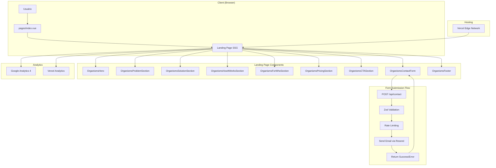

# Architecture: MVP do Site iadojeitocerto.com.br

**Feature ID**: MVP-001
**Branch**: feat/mvp-setup
**Criado em**: 2024-11-10

---

## Visão Geral de Alto Nível

O MVP é uma **landing page estática** renderizada com SSG (Static Site Generation) composta por 9 seções sequenciais que guiam o visitante pela jornada: Problema → Solução → Oferta → Conversão.

### Antes (Estado Atual)
```
/
├── .claude/                # Configurações e comandos
├── .git/                   # Repositório
├── docs/                   # Documentação de negócio
├── metaspecs/              # Meta especificações
└── specs/                  # Especificações de features
```

### Depois (MVP Completo)
```
/
├── .nuxt/                  # Build artifacts (gitignored)
├── .output/                # Build output (gitignored)
├── assets/                 # CSS, imagens não compiladas
├── components/             # Vue components (Atomic Design)
├── composables/            # Composables reutilizáveis
├── layouts/                # Layouts
├── pages/                  # File-based routing
├── public/                 # Assets estáticos
├── server/                 # Server routes (API)
├── types/                  # TypeScript types
├── app.vue                 # Root component
├── nuxt.config.ts          # Nuxt configuration
├── tailwind.config.js      # Tailwind configuration
├── tsconfig.json           # TypeScript configuration
└── package.json            # Dependencies
```

---

## Diagrama de Arquitetura



---

## Atomic Design - Hierarquia Completa

### 1. Atoms (Elementos Básicos)

```
components/atoms/
├── Button.vue              # Botões (primary, secondary, outline)
├── Input.vue               # Input de texto/email
├── Textarea.vue            # Textarea para mensagens
├── Select.vue              # Select/dropdown
├── Label.vue               # Labels de formulário
├── Heading.vue             # Headings tipográficos (h1-h6)
├── Text.vue                # Parágrafos
├── Icon.vue                # Wrapper para Nuxt Icon
├── Badge.vue               # Badges/tags
├── Divider.vue             # Linha divisória
└── Logo.vue                # Logo (placeholder SVG)
```

#### Exemplo: AtomsButton.vue
```vue
<script setup lang="ts">
interface Props {
  variant?: 'primary' | 'secondary' | 'outline'
  size?: 'sm' | 'md' | 'lg'
  disabled?: boolean
  type?: 'button' | 'submit' | 'reset'
  to?: string
}

const props = withDefaults(defineProps<Props>(), {
  variant: 'primary',
  size: 'md',
  type: 'button'
})

const buttonClasses = computed(() => [
  'inline-flex items-center justify-center font-semibold rounded-lg transition-all duration-200',
  'focus:outline-none focus:ring-2 focus:ring-offset-2',
  {
    // Sizes
    'px-4 py-2 text-sm': props.size === 'sm',
    'px-6 py-3 text-base': props.size === 'md',
    'px-8 py-4 text-lg': props.size === 'lg',

    // Variants
    'bg-primary-600 text-white hover:bg-primary-700 focus:ring-primary-500': props.variant === 'primary',
    'bg-gray-100 text-gray-900 hover:bg-gray-200 focus:ring-gray-500': props.variant === 'secondary',
    'border-2 border-primary-600 text-primary-600 hover:bg-primary-50 focus:ring-primary-500': props.variant === 'outline',

    // Disabled
    'opacity-50 cursor-not-allowed': props.disabled
  }
])
</script>

<template>
  <component
    :is="to ? 'NuxtLink' : 'button'"
    :to="to"
    :type="type"
    :disabled="disabled"
    :class="buttonClasses"
  >
    <slot />
  </component>
</template>
```

---

### 2. Molecules (Componentes Compostos)

```
components/molecules/
├── FormField.vue           # Input + Label + Error message
├── Card.vue                # Card genérico (container)
├── StatCard.vue            # Card com ícone + título + descrição
├── FeatureCard.vue         # Card de feature (problema/solução)
├── PersonaCard.vue         # Card de persona
├── TimelineStep.vue        # Step da timeline (Como Funciona)
└── SocialLinks.vue         # Grupo de links sociais
```

#### Exemplo: MoleculesFormField.vue
```vue
<script setup lang="ts">
interface Props {
  label: string
  name: string
  error?: string
  required?: boolean
  type?: 'text' | 'email' | 'tel'
  placeholder?: string
}

const props = withDefaults(defineProps<Props>(), {
  type: 'text'
})

const model = defineModel<string>()
</script>

<template>
  <div class="space-y-2">
    <AtomsLabel :for="name" :required="required">
      {{ label }}
    </AtomsLabel>

    <AtomsInput
      :id="name"
      v-model="model"
      :name="name"
      :type="type"
      :placeholder="placeholder"
      :aria-invalid="!!error"
      :aria-describedby="error ? `${name}-error` : undefined"
    />

    <p
      v-if="error"
      :id="`${name}-error`"
      class="text-sm text-red-600"
    >
      {{ error }}
    </p>
  </div>
</template>
```

---

### 3. Organisms (Seções Complexas)

```
components/organisms/
├── Header.vue              # Header com logo + navegação
├── Footer.vue              # Footer completo
├── HeroSection.vue         # Seção Hero
├── ProblemSection.vue      # Seção "O Problema"
├── SolutionSection.vue     # Seção "A Solução"
├── HowItWorksSection.vue   # Seção "Como Funciona"
├── ForWhoSection.vue       # Seção "Para Quem é?"
├── TestimonialSection.vue  # Seção de depoimento (placeholder)
├── PricingSection.vue      # Seção "A Oferta"
├── CTASection.vue          # CTA Final
└── ContactForm.vue         # Formulário completo
```

#### Exemplo: OrganismsHeroSection.vue
```vue
<script setup lang="ts">
const scrollToContact = () => {
  document.getElementById('contact')?.scrollIntoView({
    behavior: 'smooth'
  })
}
</script>

<template>
  <section class="relative bg-gradient-to-br from-primary-600 to-primary-800 py-20 md:py-32">
    <div class="container mx-auto px-4">
      <div class="max-w-4xl mx-auto text-center text-white">
        <AtomsHeading level="h1" class="text-4xl md:text-5xl lg:text-6xl font-bold mb-6">
          Pare de "Conversar" com a IA. Comece a Construir com Engenharia.
        </AtomsHeading>

        <AtomsText class="text-lg md:text-xl lg:text-2xl mb-8 opacity-90">
          Sua equipe de desenvolvimento está presa no ciclo de tentativa e erro com IA?
          A consultoria <strong>IA do Jeito Certo</strong> implementa uma metodologia de
          engenharia robusta para transformar a IA de uma ferramenta imprevisível em um
          ativo de produção escalável e de alto valor.
        </AtomsText>

        <AtomsButton
          variant="secondary"
          size="lg"
          @click="scrollToContact"
        >
          Agende uma Análise Estratégica
        </AtomsButton>
      </div>
    </div>

    <!-- Decorative background (placeholder) -->
    <div class="absolute inset-0 opacity-10 pointer-events-none">
      <!-- SVG pattern ou ilustração -->
    </div>
  </section>
</template>
```

#### Exemplo: OrganismsContactForm.vue
```vue
<script setup lang="ts">
import { useForm } from 'vee-validate'
import { toTypedSchema } from '@vee-validate/zod'
import * as z from 'zod'

// Schema de validação
const personalEmailDomains = ['gmail.com', 'hotmail.com', 'outlook.com', 'yahoo.com']

const contactSchema = toTypedSchema(
  z.object({
    name: z.string().min(2, 'Nome deve ter pelo menos 2 caracteres'),
    email: z
      .string()
      .email('Email inválido')
      .refine(
        (email) => {
          const domain = email.split('@')[1]?.toLowerCase()
          return !personalEmailDomains.includes(domain)
        },
        'Por favor, use um email corporativo'
      ),
    company: z.string().min(2, 'Nome da empresa obrigatório'),
    role: z.enum(['CTO', 'VP_Eng', 'Tech_Lead', 'Outro']),
    teamSize: z.enum(['1-10', '11-25', '26-50', '51-100', '100+']),
    message: z.string().optional()
  })
)

// Setup do form
const { handleSubmit, errors, isSubmitting } = useForm({
  validationSchema: contactSchema
})

const success = ref(false)
const errorMessage = ref('')

const onSubmit = handleSubmit(async (values) => {
  try {
    const { data, error } = await useFetch('/api/contact', {
      method: 'POST',
      body: values
    })

    if (error.value) {
      errorMessage.value = 'Erro ao enviar formulário. Tente novamente.'
      return
    }

    success.value = true
    // Track analytics event
    if (typeof gtag !== 'undefined') {
      gtag('event', 'form_submit', {
        form_name: 'contact',
        value: values.company
      })
    }
  } catch (err) {
    errorMessage.value = 'Erro ao enviar formulário. Tente novamente.'
  }
})
</script>

<template>
  <section id="contact" class="py-16 md:py-24 bg-gray-50">
    <div class="container mx-auto px-4">
      <div class="max-w-2xl mx-auto">
        <AtomsHeading level="h2" class="text-3xl md:text-4xl font-bold text-center mb-12">
          Agende sua Análise Estratégica Gratuita
        </AtomsHeading>

        <div v-if="success" class="bg-green-50 border border-green-200 rounded-lg p-6">
          <p class="text-green-800 text-center">
            ✓ Mensagem enviada com sucesso! Entraremos em contato em breve.
          </p>
        </div>

        <form v-else @submit="onSubmit" class="space-y-6 bg-white p-8 rounded-lg shadow-md">
          <MoleculesFormField
            v-model="name"
            name="name"
            label="Nome completo"
            :error="errors.name"
            required
            placeholder="Ricardo Silva"
          />

          <MoleculesFormField
            v-model="email"
            name="email"
            type="email"
            label="Email corporativo"
            :error="errors.email"
            required
            placeholder="ricardo@empresa.com.br"
          />

          <MoleculesFormField
            v-model="company"
            name="company"
            label="Empresa"
            :error="errors.company"
            required
            placeholder="Empresa Tech LTDA"
          />

          <div class="grid grid-cols-1 md:grid-cols-2 gap-6">
            <MoleculesFormField
              v-model="role"
              name="role"
              type="select"
              label="Cargo"
              :error="errors.role"
              required
              :options="[
                { value: 'CTO', label: 'CTO' },
                { value: 'VP_Eng', label: 'VP de Engenharia' },
                { value: 'Tech_Lead', label: 'Tech Lead' },
                { value: 'Outro', label: 'Outro' }
              ]"
            />

            <MoleculesFormField
              v-model="teamSize"
              name="teamSize"
              type="select"
              label="Tamanho do time"
              :error="errors.teamSize"
              required
              :options="[
                { value: '1-10', label: '1-10 devs' },
                { value: '11-25', label: '11-25 devs' },
                { value: '26-50', label: '26-50 devs' },
                { value: '51-100', label: '51-100 devs' },
                { value: '100+', label: '100+ devs' }
              ]"
            />
          </div>

          <MoleculesFormField
            v-model="message"
            name="message"
            type="textarea"
            label="Mensagem (opcional)"
            :error="errors.message"
            placeholder="Conte-nos sobre seus desafios com IA..."
          />

          <p v-if="errorMessage" class="text-sm text-red-600">
            {{ errorMessage }}
          </p>

          <AtomsButton
            type="submit"
            variant="primary"
            size="lg"
            :disabled="isSubmitting"
            class="w-full"
          >
            {{ isSubmitting ? 'Enviando...' : 'Enviar' }}
          </AtomsButton>
        </form>

        <p class="text-center text-gray-600 mt-4 text-sm">
          Tem uma pergunta rápida?
          <a href="mailto:contato@iadojeitocerto.com.br" class="text-primary-600 hover:underline">
            contato@iadojeitocerto.com.br
          </a>
        </p>
      </div>
    </div>
  </section>
</template>
```

---

### 4. Templates (Layouts)

```
layouts/
└── default.vue             # Layout padrão (Header + Slot + Footer)
```

---

### 5. Pages (Instâncias)

```
pages/
└── index.vue               # Landing page (composição de seções)
```

#### pages/index.vue
```vue
<script setup lang="ts">
useSeoMeta({
  title: 'IA do Jeito Certo - Transforme IA em Engenharia',
  description: 'Consultoria especializada em transformar desenvolvimento assistido por IA de vibe coding para disciplina de engenharia robusta.',
  ogTitle: 'IA do Jeito Certo',
  ogDescription: 'Metodologia Metaspecs: Engenharia de Contextos + Spec-Driven Development',
  ogImage: '/images/og-image.jpg',
  ogUrl: 'https://iadojeitocerto.com.br',
  twitterCard: 'summary_large_image'
})
</script>

<template>
  <div class="min-h-screen">
    <OrganismsHeroSection />
    <OrganismsProblemSection />
    <OrganismsSolutionSection />
    <OrganismsHowItWorksSection />
    <OrganismsForWhoSection />
    <OrganismsTestimonialSection />
    <OrganismsPricingSection />
    <OrganismsCTASection />
    <OrganismsContactForm />
  </div>
</template>
```

---

## Composables (Lógica Reutilizável)

```
composables/
├── useContactForm.ts       # Lógica do formulário de contato
├── useScrollAnimation.ts   # Animações on scroll
└── useAnalytics.ts         # Tracking de eventos
```

### Exemplo: composables/useScrollAnimation.ts
```typescript
import { useElementVisibility } from '@vueuse/core'

export const useScrollAnimation = () => {
  const target = ref(null)
  const isVisible = useElementVisibility(target)

  const animationClasses = computed(() => ({
    'opacity-0 translate-y-10': !isVisible.value,
    'opacity-100 translate-y-0': isVisible.value
  }))

  return {
    target,
    isVisible,
    animationClasses
  }
}
```

---

## Server Routes (API)

```
server/
├── api/
│   └── contact.post.ts     # POST /api/contact
├── middleware/
│   └── rateLimit.ts        # Rate limiting middleware
└── utils/
    ├── email.ts            # Email sender (Resend)
    └── validation.ts       # Server-side validation helpers
```

### server/api/contact.post.ts
```typescript
import { z } from 'zod'
import { Resend } from 'resend'

const resend = new Resend(process.env.RESEND_API_KEY)

const personalEmailDomains = ['gmail.com', 'hotmail.com', 'outlook.com', 'yahoo.com']

const contactSchema = z.object({
  name: z.string().min(2),
  email: z.string().email().refine(
    (email) => {
      const domain = email.split('@')[1]?.toLowerCase()
      return !personalEmailDomains.includes(domain)
    },
    'Email corporativo obrigatório'
  ),
  company: z.string().min(2),
  role: z.enum(['CTO', 'VP_Eng', 'Tech_Lead', 'Outro']),
  teamSize: z.enum(['1-10', '11-25', '26-50', '51-100', '100+']),
  message: z.string().optional()
})

export default defineEventHandler(async (event) => {
  // Rate limiting (5 requests per hour per IP)
  const ip = getRequestIP(event)
  // TODO: Implement rate limiting logic

  // Validação
  const body = await readBody(event)
  const result = contactSchema.safeParse(body)

  if (!result.success) {
    throw createError({
      statusCode: 400,
      statusMessage: 'Dados inválidos',
      data: result.error.flatten().fieldErrors
    })
  }

  const data = result.data

  // Enviar email
  try {
    await resend.emails.send({
      from: 'noreply@iadojeitocerto.com.br',
      to: 'contato@iadojeitocerto.com.br',
      subject: `Novo Lead: ${data.name} - ${data.company}`,
      html: `
        <h2>Novo contato do site</h2>
        <p><strong>Nome:</strong> ${data.name}</p>
        <p><strong>Email:</strong> ${data.email}</p>
        <p><strong>Empresa:</strong> ${data.company}</p>
        <p><strong>Cargo:</strong> ${data.role}</p>
        <p><strong>Tamanho do time:</strong> ${data.teamSize}</p>
        ${data.message ? `<p><strong>Mensagem:</strong><br>${data.message}</p>` : ''}
      `
    })

    return { success: true }
  } catch (error) {
    throw createError({
      statusCode: 500,
      statusMessage: 'Erro ao enviar email'
    })
  }
})
```

---

## Fluxo de Dados

### Landing Page (Rendering)
```
1. Usuário acessa iadojeitocerto.com.br
   ↓
2. Vercel Edge Network serve HTML pré-renderizado (SSG)
   ↓
3. Browser hydrates Vue components
   ↓
4. Animações on-scroll ativadas (VueUse)
   ↓
5. Google Analytics track pageview
```

### Formulário de Contato (Submission)
```
1. Usuário preenche formulário
   ↓
2. Validação client-side (vee-validate + Zod)
   ↓
3. Submit → POST /api/contact
   ↓
4. Server valida novamente (Zod)
   ↓
5. Rate limiting check (IP-based)
   ↓
6. Send email via Resend API
   ↓
7. Return success/error
   ↓
8. UI mostra mensagem de confirmação
   ↓
9. Google Analytics track event 'form_submit'
```

---

## Dependências e Integrações

### Stack Principal
```json
{
  "dependencies": {
    "nuxt": "^3.10.0",
    "vue": "^3.4.0",
    "@nuxtjs/tailwindcss": "^6.11.0",
    "@nuxt/icon": "^1.0.0",
    "@vueuse/core": "^10.7.0",
    "vee-validate": "^4.12.0",
    "@vee-validate/zod": "^4.12.0",
    "zod": "^3.22.0",
    "resend": "^3.0.0"
  },
  "devDependencies": {
    "typescript": "^5.3.0",
    "@nuxt/devtools": "^1.0.0",
    "prettier": "^3.2.0",
    "prettier-plugin-tailwindcss": "^0.5.0",
    "@tailwindcss/typography": "^0.5.10",
    "@tailwindcss/forms": "^0.5.7"
  }
}
```

### Serviços Externos
1. **Resend** (resend.com)
   - Envio de emails transacionais
   - API Key em `.env`: `RESEND_API_KEY`

2. **Vercel** (vercel.com)
   - Hosting + CDN + Analytics
   - Deploy automático via Git

3. **Google Analytics 4** (analytics.google.com)
   - Tracking de eventos e conversões
   - Measurement ID em `.env`: `GA_MEASUREMENT_ID`

---

## Padrões e Melhores Práticas

### 1. TypeScript Strict Mode
- **NUNCA** usar `any`
- Todas as props tipadas com `interface`
- Todos os emits declarados com `defineEmits<{...}>()`
- Composables retornam tipos explícitos

### 2. Tailwind CSS Only
- **SEM** CSS customizado (exceto raridades)
- Usar classes utilitárias
- Design tokens no `tailwind.config.js`

### 3. Atomic Design Rigoroso
- Átomos não dependem de outros átomos
- Moléculas combinam 2+ átomos
- Organismos são seções completas
- Pages compõem organismos

### 4. Acessibilidade (WCAG 2.1 AA)
- Labels em todos os inputs
- ARIA attributes apropriados
- Focus management
- Keyboard navigation
- Color contrast > 4.5:1

### 5. Performance
- Lazy loading de componentes pesados
- Code splitting automático (Nuxt)
- Image optimization (placeholders SVG)
- Bundle size < 150kb

---

## Restrições e Suposições

### Restrições
1. **Sem Dark Mode** no MVP (Fase 2)
2. **Sem i18n** (apenas português-BR)
3. **Sem autenticação** (landing page pública)
4. **Sem CMS** no MVP (conteúdo hardcoded)
5. **Sem CAPTCHA** (rate limiting apenas)

### Suposições
1. Domínio `iadojeitocerto.com.br` já configurado
2. Email `contato@iadojeitocerto.com.br` existe no Resend
3. Assets visuais serão placeholders SVG
4. Whitepaper será criado depois (link placeholder)
5. Tráfego MVP < 10k visitas/mês (Vercel free tier)

---

## Trade-offs e Alternativas

### 1. SSG vs SSR
**Decisão**: SSG (Static Site Generation)
**Alternativa**: SSR (Server-Side Rendering)
**Trade-off**: SSG é mais rápido e barato, mas conteúdo é estático. Como landing page muda pouco, SSG é ideal.

### 2. Vee-Validate vs React Hook Form
**Decisão**: Vee-Validate (Vue-native)
**Alternativa**: Formkit, Vue Formulate
**Trade-off**: Vee-Validate + Zod dá type-safety e validação declarativa. Melhor DX.

### 3. Resend vs SendGrid
**Decisão**: Resend
**Alternativa**: SendGrid, Postmark, AWS SES
**Trade-off**: Resend é mais moderno, DX melhor, pricing transparente. SendGrid tem mais features mas é mais complexo.

### 4. Monorepo vs Single Repo
**Decisão**: Single repo
**Alternativa**: Monorepo (Turborepo, Nx)
**Trade-off**: MVP simples não justifica monorepo. Se adicionar backend complexo na Fase 2, reavaliar.

---

## Consequências

### Positivas ✅
- Performance excelente (SSG + Vercel Edge)
- SEO otimizado (HTML pré-renderizado)
- Custo zero de hosting (Vercel free tier)
- Type-safety completa (TypeScript strict)
- Componentes reutilizáveis (Atomic Design)
- Fácil manutenção (Nuxt conventions)

### Negativas ⚠️
- Conteúdo estático (rebuild para mudar texto)
- Sem dark mode (decisão consciente)
- Sem CMS (decisão consciente pro MVP)
- Placeholders para assets visuais (temporário)

---

## Principais Arquivos a Criar/Editar

### Configuração (Setup)
- [ ] `package.json` - Dependências
- [ ] `nuxt.config.ts` - Configuração do Nuxt
- [ ] `tailwind.config.js` - Design system
- [ ] `tsconfig.json` - TypeScript config
- [ ] `.env` - Variáveis de ambiente
- [ ] `app.vue` - Root component

### Átomos (11 componentes)
- [ ] `components/atoms/Button.vue`
- [ ] `components/atoms/Input.vue`
- [ ] `components/atoms/Textarea.vue`
- [ ] `components/atoms/Select.vue`
- [ ] `components/atoms/Label.vue`
- [ ] `components/atoms/Heading.vue`
- [ ] `components/atoms/Text.vue`
- [ ] `components/atoms/Icon.vue`
- [ ] `components/atoms/Badge.vue`
- [ ] `components/atoms/Divider.vue`
- [ ] `components/atoms/Logo.vue`

### Moléculas (7 componentes)
- [ ] `components/molecules/FormField.vue`
- [ ] `components/molecules/Card.vue`
- [ ] `components/molecules/StatCard.vue`
- [ ] `components/molecules/FeatureCard.vue`
- [ ] `components/molecules/PersonaCard.vue`
- [ ] `components/molecules/TimelineStep.vue`
- [ ] `components/molecules/SocialLinks.vue`

### Organismos (11 componentes)
- [ ] `components/organisms/Header.vue`
- [ ] `components/organisms/Footer.vue`
- [ ] `components/organisms/HeroSection.vue`
- [ ] `components/organisms/ProblemSection.vue`
- [ ] `components/organisms/SolutionSection.vue`
- [ ] `components/organisms/HowItWorksSection.vue`
- [ ] `components/organisms/ForWhoSection.vue`
- [ ] `components/organisms/TestimonialSection.vue`
- [ ] `components/organisms/PricingSection.vue`
- [ ] `components/organisms/CTASection.vue`
- [ ] `components/organisms/ContactForm.vue`

### Pages
- [ ] `pages/index.vue` - Landing page

### Layouts
- [ ] `layouts/default.vue` - Layout padrão

### Server Routes
- [ ] `server/api/contact.post.ts` - API de contato
- [ ] `server/utils/email.ts` - Email sender
- [ ] `server/middleware/rateLimit.ts` - Rate limiting

### Composables
- [ ] `composables/useContactForm.ts`
- [ ] `composables/useScrollAnimation.ts`
- [ ] `composables/useAnalytics.ts`

### Types
- [ ] `types/index.ts` - TypeScript types globais

### Assets
- [ ] `assets/css/tailwind.css` - Tailwind directives
- [ ] `public/favicon.ico` - Favicon
- [ ] `public/images/og-image.jpg` - Open Graph image

---

## ADRs (Architecture Decision Records)

### ADR-001: SSG para Landing Page
**Contexto**: Landing page com conteúdo majoritariamente estático
**Decisão**: Usar Static Site Generation (SSG)
**Consequências**: Performance máxima, SEO perfeito, custo zero

### ADR-002: Atomic Design
**Contexto**: Necessidade de componentes reutilizáveis e escaláveis
**Decisão**: Seguir Atomic Design rigorosamente
**Consequências**: Hierarquia clara, fácil manutenção, curva de aprendizado inicial

### ADR-003: TypeScript Strict Mode
**Contexto**: Prevenir bugs em runtime
**Decisão**: TypeScript strict mode obrigatório
**Consequências**: Type-safety completa, menos bugs, DX melhor

### ADR-004: Tailwind CSS Only
**Contexto**: Desenvolvimento rápido e consistente
**Decisão**: Sem CSS customizado (exceto casos raros)
**Consequências**: Desenvolvimento mais rápido, bundle otimizado, design system via config

### ADR-005: Email via Resend
**Contexto**: Formulário de contato precisa enviar emails
**Decisão**: Usar Resend API
**Consequências**: Setup simples, DX excelente, confiável

---

**Status**: ✅ Arquitetura completa - Pronta para implementação
